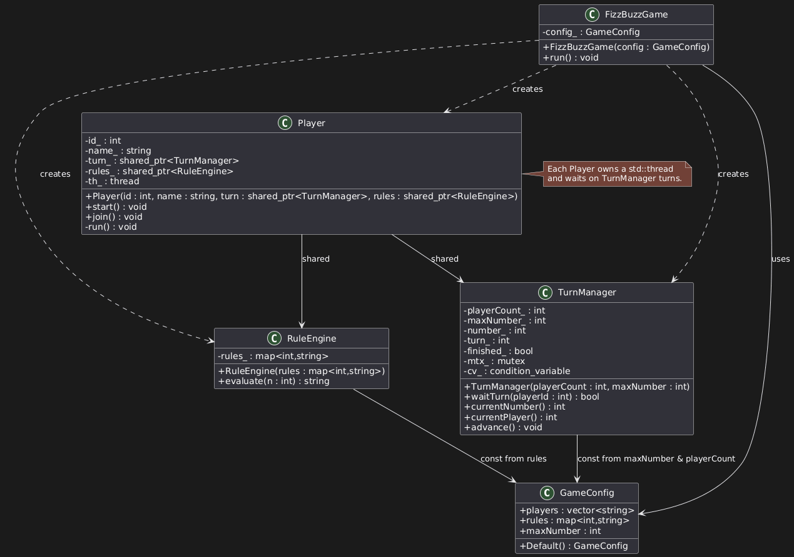

# Fizzbuzz_threads

## Carlos Mario Minu Quiroga
cm.minu10@uniandes.edu.co

A small C++17 FizzBuzz game that runs players on separate threads and coordinates turns so output stays in order.

## How it works
- A `TurnManager` serializes turns with a mutex/condition variable.
- A `RuleEngine` evaluates the number against divisor rules (e.g., 3 -> fizz, 5 -> buzz).
- Each `Player` runs in its own `std::thread` and prints on its turn.
- `FizzBuzzGame` wires everything together using a `GameConfig`.

## Build

```bash
cmake -S . -B build
cmake --build build
```

## Run

```bash
./build/fizzbuzz
```

## Configuration
The game is configured via `GameConfig`
- `players`: list of player names in turn order.
- `rules`: map of divisor -> word.
- `maxNumber`: last number to play.

`main.cpp` shows two examples:
1. Default config with players and 3/5 rules.
2. Custom config with players and 2/7 rules.


## Project layout
- `include/` public headers
- `src/` implementation
- `CMakeLists.txt` build configuration
- `build/` build output     
- `README.md` this file
- `images/` UML diagrams

## Notes
- Output order is deterministic because turns are synchronized; threads only print when `TurnManager` grants their turn.
- The rule evaluation concatenates words in rule order (ascending divisor due to `std::map`).
- Each player has shared access to the `TurnManager` and the `RuleEngine`.
- Mutex ensures thread-safe turn management.
- Condition variable allows players to wait for their turn without busy-waiting.
- The game continues until the maximum number is reached, at which point all threads exit gracefully.


## Class Diagram




## Sequence Diagram


## Example output

```text
Abdul says 1
Bart says 2
Claudia says fizz!
Divya says 4
Abdul says buzz!
Bart says fizz!
Claudia says 7
Divya says 8
Abdul says fizz!
Bart says buzz!
Claudia says 11
Divya says fizz!
Abdul says 13
Bart says 14
Claudia says fizzbuzz!
Divya says 16
Abdul says 17
Bart says fizz!
Claudia says 19
Divya says buzz!
Abdul says fizz!
Bart says 22
Claudia says 23
Divya says fizz!
Abdul says buzz!
Bart says 26
Claudia says fizz!
Divya says 28
Abdul says 29
Bart says fizzbuzz!
```

## Output for this configuration

```Code          
       GameConfig config;
       config.players = {"Ana","Luis","Sofi"};
       config.rules = {{2,"foo"},{7,"bar"}};
       config.maxNumber = 25;

       FizzBuzzGame game(config);
       game.run();
```

```text
Ana says 1
Luis says foo!
Sofi says 3
Ana says foo!
Luis says 5
Sofi says foo!
Ana says bar!
Luis says foo!
Sofi says 9
Ana says foo!
Luis says 11
Sofi says foo!
Ana says 13
Luis says foobar!
Sofi says 15
Ana says foo!
Luis says 17
Sofi says foo!
Ana says 19
Luis says foo!
Sofi says bar!
Ana says foo!
Luis says 23
Sofi says foo!
Ana says 25
